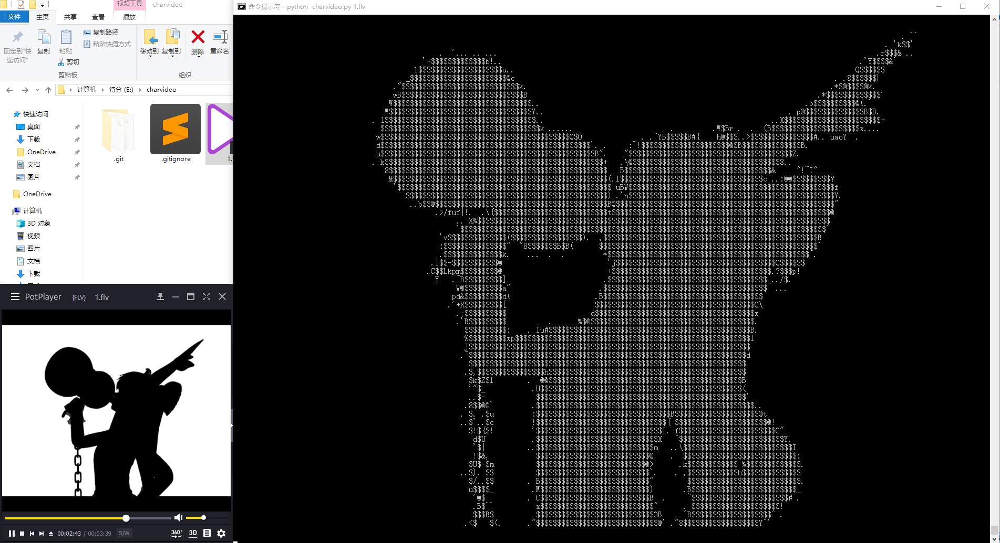
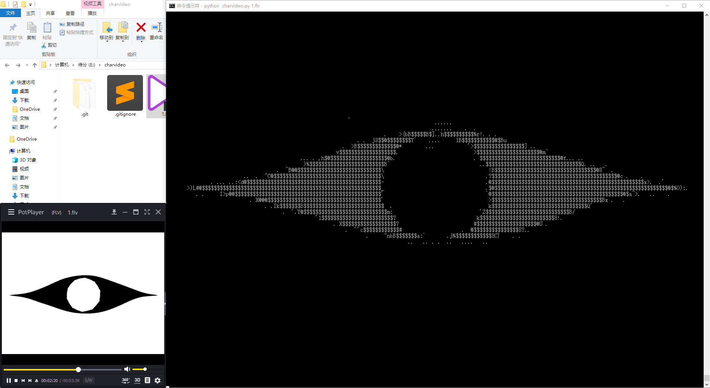
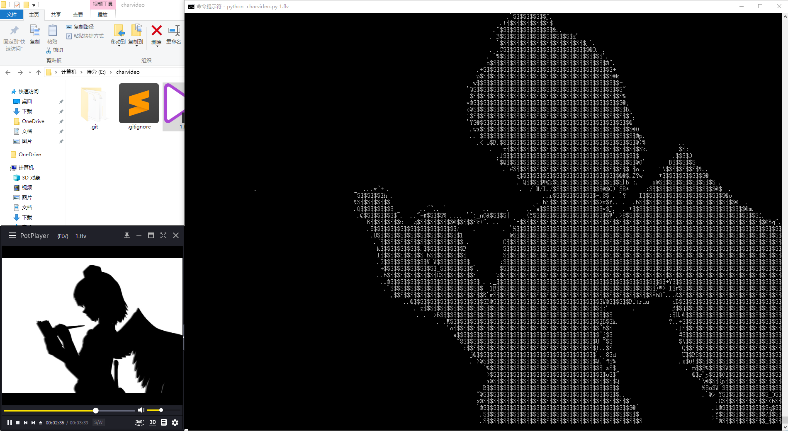
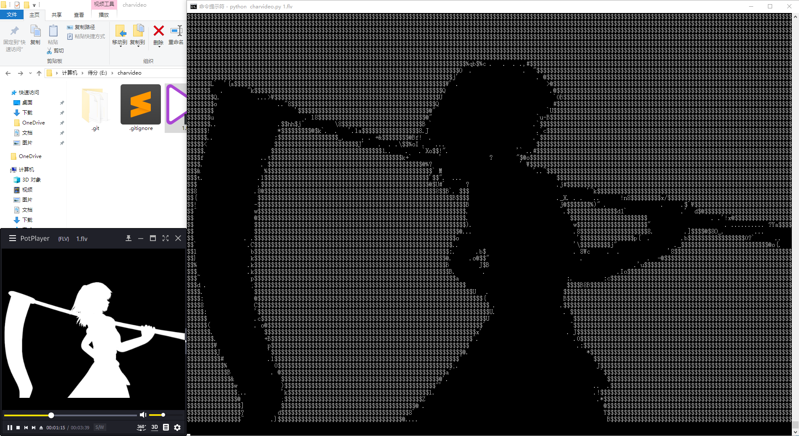

### 介绍
将视频以字符画的形式在控制台播放
 
 
 


### 使用例
```bash
python charvideo.py E:/badapple.flv --width 180 --heigh 70
```
参数说明
```bash
charvideo.py [-h] [--width WIDTH] [--height HEIGHT] [--gap GAP] file
```
`--width`是每行显示的字符数量 
`--height`是行数 
这两个参数取决于你控制台的尺寸 
`--gap`是帧间隔，默认是1，每帧都会打印 

### 依赖的环境
安装cv2库
```bash
pip3 install opencv-python
```

### 参考的课程
[Python 图片转字符画](https://www.shiyanlou.com/courses/370)

### 另外的一些思路
抓取图片并保存，但是图片的效果并不好
```python
# x, y, width, height
ImageGrab.grab(bbox=(0,0,1455,1035)).save( 'img.jpg' )
```

将图片集转换为视频，存在视频文件过大的情况，并且视频的时长难以精确设置
```python
import os
import cv2
import time

path = 'E:/charvideo/frame/'
imgList = os.listdir(path)
imgList.sort(key = lambda x: int(x[:-4]))

fourcc = cv2.VideoWriter_fourcc(*'XVID')
video = cv2.VideoWriter("badapple.mp4", fourcc, 25, (1455,1035))

for img in imgList:
    if img.endswith('.jpg'):
        img='E:/charvideo/frame/' + img
        _img = cv2.imread(img)
        video.write(_img)
        time.sleep(0.033)

video.release()
```